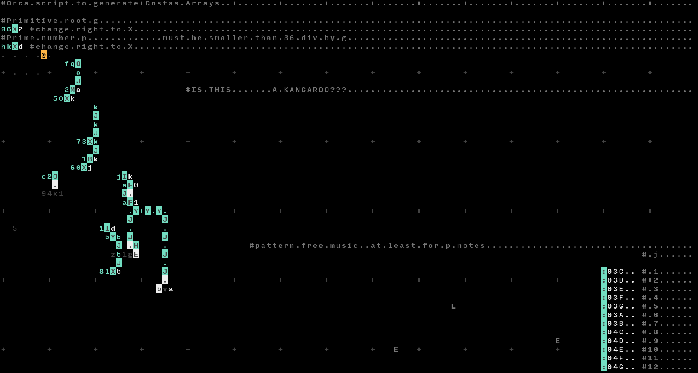

# Ugliest Orca

This is a script written in [Orca](https://100r.co/site/orca.html) generating "pattern free music" using [Costas arrays](https://en.wikipedia.org/wiki/Costas_array) and is inspired by Scott Rickard's ["The World's Ugliest Music"](https://www.youtube.com/watch?v=RENk9PK06AQ)



Due to the limitations of the Orca language, having base 36 one digit numbers only, the maximum order of Costas array which can be generated using this script is `p = 13` using the primitive root `g = 2`, since the largest possible remainder (`16`) of the next larger prime `p = 17` multiplied with its lowest primitive root `g = 3` would cause the multiplication operator to overflow (`16 * 3 = 48 > 36`).

Have a look at the following table copied from [Wikipedia](https://en.wikipedia.org/wiki/Primitive_root_modulo_n) for possible primes and their primitive roots:

|p|primitive roots modulo p|
|--|------------------------|
|*5*|*2*, *3*|
|*7*|*3*, *5*|
|*11 or b*|*2*, 6, 7, 8|
|*13 or d*|*2*, 6, 7, 11|
|17|3, 3, 5, 6, 7, 10, 11, 12, 14|

note that only the cursive ones satisfy the condition explained in the first paragraph.

This music is obviously only pattern free in its `p` notes, after which the sequence is being repeated. Unlike the performance in the talk the rhythm of the music generated by this script isn't special in any way and determined by the way the generation works.

Speaking of generation: All this script really does is multiplying the previously calculated number with `g` and taking it modulo `p`, repeating this over and over. Because Orca removed the previously included modulo operator, I implemented it using the increment operator which allows to pass a modulo, but results in this confusing script (which accidentally looks like a kangaroo).

I'm pretty sure this script is far from optimal and the task can be solved more cleanly and with less code, nevertheless this was a fun experiment to find out what could be done with Orca.

## Checking the results of the script
There is a quick Python script included in the repository to check whether the Orca script works as expected (hex is sufficient base36 emulation because p can't be larger than 13 to be handled by the script, see the first paragraph):

```python
def costas_array(p, g):
    for i in range(p):
        print(hex(g**i % p))
```
## glorious youtube comments about the value of such music for society

(found [here](https://www.youtube.com/watch?v=RaoRNMmpa_s))
